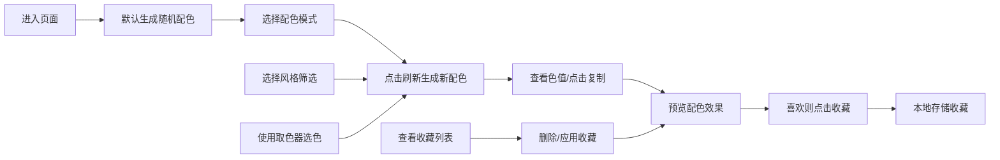

## 1. 产品概述

配色灵感工具是一款面向设计师、开发者和创意工作者的在线配色辅助工具，帮助用户快速获取、筛选和预览专业配色方案，解决设计过程中色彩搭配的痛点。

- **核心价值**：提供专业、便捷、高效的配色方案生成与管理体验
- **目标用户**：UI/UX 设计师、前端开发者、平面设计师、插画师等创意从业者
- **产品定位**：轻量、专业、无学习成本的在线配色工具

---

## 2. 核心功能

### 2.1 用户角色
| 角色 | 注册方式 | 核心权限 |
|------|----------|----------|
| 普通用户 | 无需注册 | 使用全部功能，本地存储收藏 |

### 2.2 功能模块
1. **配色生成区**：单色、双色、三色渐变、四色组合，一键刷新
2. **色值展示区**：HEX/RGB/HSL 三种格式展示与一键复制
3. **分类筛选区**：按风格筛选（莫兰迪、马卡龙、复古、冷色调、暖色调）
4. **收藏管理区**：本地 localStorage 收藏与删除
5. **实时预览区**：文字、按钮、卡片的配色效果预览
6. **取色器区**：浏览器原生取色器，自定义颜色搭配

### 2.3 页面详情
| 页面名称 | 模块名称 | 功能描述 |
|---------|----------|----------|
| 主页面 | 配色生成区 | 四种配色模式切换，随机生成按钮，渐变支持角度调节 |
| 主页面 | 色值展示区 | 卡片式展示每种颜色，悬停显示三种格式，点击复制 |
| 主页面 | 分类筛选区 | 标签式筛选按钮，支持多选组合筛选 |
| 主页面 | 收藏管理区 | 收藏按钮，收藏列表展示，删除功能 |
| 主页面 | 实时预览区 | 三个预览模块（文字、按钮、卡片）动态应用当前配色 |
| 主页面 | 取色器区 | 原生颜色选择器，手动取色后自动加入当前配色 |

---

## 3. 核心流程

**主流程描述**：
1. 用户进入页面，默认自动生成一组配色方案
2. 用户可切换单色/双色/三色渐变/四色组合模式
3. 点击刷新按钮生成新的配色，或通过风格筛选获取特定风格配色
4. 点击色值卡片自动复制对应格式的颜色代码
5. 预览区实时展示配色在文字、按钮、卡片上的效果
6. 喜欢的配色可点击收藏，存储在本地 localStorage
7. 支持使用浏览器原生取色器自定义颜色
8. 可随时查看、删除或应用已收藏的配色

---

## 4. 用户界面设计

### 4.1 设计风格
- **主色调**：深灰蓝色背景 (#0f172a)，营造专业设计工具氛围
- **强调色**：霓虹感的交互色，与配色方案形成鲜明对比
- **按钮风格**：圆角胶囊按钮，悬停微动效，点击缩放反馈
- **字体**：标题使用 'Space Mono' 等宽字体，正文使用 'Inter' 无衬线字体
- **布局风格**：卡片式栅格布局，内容区居中，充分留白
- **视觉元素**：微妙的渐变背景、玻璃拟态效果、柔和投影

### 4.2 页面设计概述
| 模块名称 | UI 元素 | 设计要点 |
|---------|----------|----------|
| 顶部导航 | Logo、功能标签切换 | 半透明毛玻璃背景，平滑滚动动画 |
| 配色生成区 | 大色块展示、模式切换按钮、刷新按钮 | 色块占比 60%，悬停放大效果，渐变色块支持角度指示器 |
| 色值展示区 | 色值卡片、格式标签 | 卡片式设计，点击反馈动效，复制成功提示 |
| 分类筛选区 | 标签按钮组 | 胶囊形状，选中态有发光效果 |
| 预览面板 | 文字预览、按钮预览、卡片预览 | 实时颜色更新，过渡动画 0.3s |
| 收藏面板 | 收藏列表缩略图、删除按钮 | 网格布局，悬停显示操作按钮 |
| 取色器 | 颜色选择器、添加按钮 | 原生 input[type=color] 美化 |

### 4.3 响应式设计
- **桌面端**（1280px+）：三栏布局，左侧筛选/收藏，中间主配色区，右侧预览
- **平板端**（768px-1279px）：两栏布局，主配色区占满宽度，筛选/收藏与预览上下排布
- **移动端**（<768px）：单列流式布局，所有模块垂直排列，触摸交互优化
- **触摸优化**：按钮最小尺寸 44x44px，色块点击区域扩大

### 4.4 动效设计
- 页面加载：色块渐入动画，错峰延迟显示
- 刷新配色：色块淡出→新色淡入，带轻微缩放
- 悬停效果：色块放大 1.02 倍，投影加深
- 复制成功：弹出 Toast 提示，向上滑动消失
- 收藏/取消：心形图标缩放弹跳动画
- 颜色切换：预览区颜色平滑过渡 0.3s
