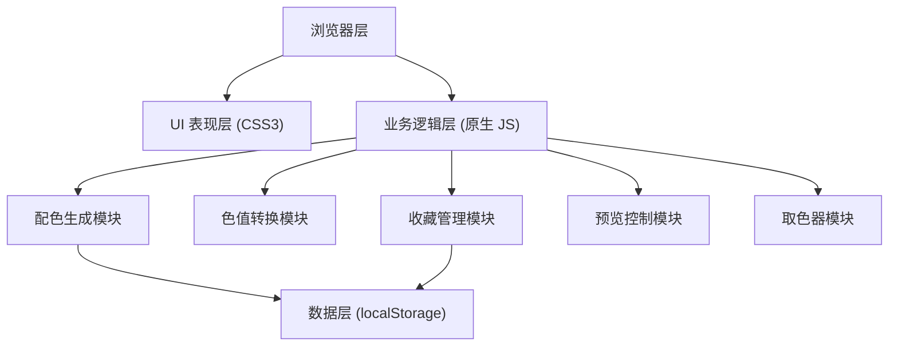

## 1. 架构设计



**架构说明**：
- 纯前端单页应用，无后端服务依赖
- 采用模块化原生 JavaScript 架构，按功能划分模块
- 数据持久化通过浏览器 localStorage 实现
- UI 层完全使用 CSS3，零 CSS 框架依赖

---

## 2. 技术描述

- **前端技术栈**：HTML5 + CSS3 + ES6+ JavaScript（原生，无框架）
- **构建工具**：无，直接运行静态文件
- **CSS 特性**：CSS Variables、Grid、Flexbox、动画、渐变、伪类
- **JS 特性**：模块化 IIFE、DOM 操作 API、localStorage API、Clipboard API、EyeDropper API
- **字体**：Google Fonts（Space Mono + Inter）
- **图标**：纯 CSS 绘制 + Unicode 字符，零图标库依赖

---

## 3. 目录结构

```
cly-34/
├── index.html              # 主页面
├── css/
│   └── style.css           # 所有样式（包含 CSS 变量、动画、响应式）
├── js/
│   ├── colorUtils.js       # 颜色转换工具（HEX/RGB/HSL）
│   ├── paletteGenerator.js # 配色生成算法
│   ├── storage.js          # localStorage 操作封装
│   ├── uiController.js     # UI 交互控制
│   └── app.js              # 应用入口，初始化所有模块
└── .trae/
    └── documents/          # 项目文档
```

---

## 4. 核心模块设计

### 4.1 颜色转换模块 (colorUtils.js)
```javascript
// 核心函数
hexToRgb(hex)          // HEX → RGB
rgbToHex(r, g, b)      // RGB → HEX
rgbToHsl(r, g, b)      // RGB → HSL
hslToRgb(h, s, l)      // HSL → RGB
hexToHsl(hex)          // HEX → HSL
hslToHex(h, s, l)      // HSL → HEX
getContrastColor(hex)  // 获取对比色（黑/白文字）
isLightColor(hex)      // 判断是否为亮色
```

### 4.2 配色生成模块 (paletteGenerator.js)
```javascript
// 配色模式
generateMono()         // 单色（同色相不同明度）
generateDual()         // 双色（互补色/邻近色）
generateTriple()       // 三色渐变
generateQuad()         // 四色组合

// 风格筛选
filterByStyle(colors, style) // 莫兰迪/马卡龙/复古/冷/暖色调
```

### 4.3 存储模块 (storage.js)
```javascript
saveFavorite(palette)  // 保存收藏
getFavorites()         // 获取所有收藏
removeFavorite(id)     // 删除收藏
isFavorite(id)         // 是否已收藏
```

### 4.4 UI 控制模块 (uiController.js)
```javascript
renderPalette(colors)  // 渲染配色
updatePreview(colors)  // 更新预览面板
showToast(message)     // 显示提示
copyToClipboard(text)  // 复制到剪贴板
bindEvents()           // 绑定所有事件
```

---

## 5. 数据模型

### 5.1 配色方案数据结构
```javascript
{
  id: "timestamp_random",
  mode: "mono|dual|triple|quad",
  colors: [
    { hex: "#FF5733", rgb: "rgb(255,87,51)", hsl: "hsl(9,100%,60%)" },
    ...
  ],
  style: ["morandi", "macaron", "vintage", "cool", "warm"],
  gradient: { angle: 135, type: "linear" }, // 仅渐变模式
  createdAt: 1717234567890
}
```

### 5.2 localStorage 存储键名
- `color_palette_favorites` - 收藏的配色方案数组

---

## 6. 核心算法

### 6.1 随机配色生成算法
1. **单色模式**：随机色相 H，生成 5 个不同明度/饱和度的同色系颜色
2. **双色模式**：随机色相 H，生成 H 和 H+180°（互补色）各 2 个明度变体
3. **三色渐变模式**：随机起始色 H1，随机结束色 H2，在 HSL 空间插值生成 3 个渐变色
4. **四色组合模式**：使用四等分色环（H, H+90°, H+180°, H+270°）或随机和谐色组合

### 6.2 风格筛选算法
| 风格 | HSL 约束条件 |
|------|-------------|
| 莫兰迪 | 饱和度 15%-35%，明度 40%-70% |
| 马卡龙 | 饱和度 40%-60%，明度 75%-90% |
| 复古 | 色相偏红橙黄，饱和度 30%-50%，明度 30%-60% |
| 冷色调 | 色相 180°-300°（青/蓝/紫） |
| 暖色调 | 色相 0°-60° 或 300°-360°（红/橙/黄/粉） |

---

## 7. 浏览器兼容性

- **现代浏览器**：Chrome 90+, Firefox 88+, Safari 14+, Edge 90+
- **EyeDropper API**：Chrome 95+, Edge 95+（降级为 input[type=color]）
- **Clipboard API**：所有现代浏览器支持
- **CSS 特性**：Grid、CSS Variables、动画均完全支持
